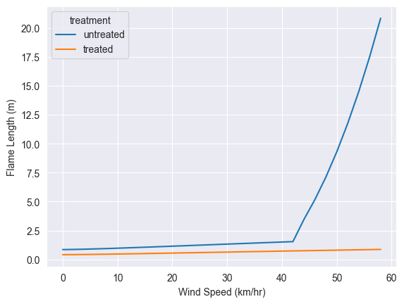

```python
import pyrothermel
import pandas as pd
import seaborn as sns

from example import canopy_base_height, canopy_bulk_density
```

## Setup Base Fuel Model and Moisture Scenario


```python
moisture = pyrothermel.MoistureScenario.from_existing(dead_fuel_moisture_class='low',live_fuel_moisture_class='moderate')
fuel = pyrothermel.FuelModel.from_existing(identifier='TL8')
canopy_base_height = 2.5 # default unit is m
canopy_bulk_density = .1 # default unit is kg/m^3

# Print some fuel loading values from fuel model TL8
print([fuel.fuel_load_one_hour, fuel.fuel_load_ten_hour, fuel.fuel_load_hundred_hour])
print(fuel.units.loading_units)

```

    [1.300187341185569, 0.31383832373444764, 0.2465872543627803]
    LoadingUnitsEnum.KilogramsPerSquareMeter
    

## Run Rothermel Models Across Range of Wind Speeds


```python
results_list = []
for wind_speed in range(0,60):
    run = pyrothermel.PyrothermelRun(fuel,moisture,wind_speed,wind_input_mode='ten_meter',canopy_base_height=canopy_base_height,canopy_bulk_density=canopy_bulk_density,canopy_cover=.5,canopy_height=20,canopy_ratio=.6)
    results_surface = run.run_surface_fire_in_direction_of_max_spread()
    results_final = run.run_crown_fire_scott_and_reinhardt()
    results_final['wind_speed'] = wind_speed
    results_final['treatment'] = 'untreated'
    results_list.append(results_final)
    
untreated_crowning_index = run.calculate_crowning_index()
untreated_torching_index = run.calculate_torching_index()
    
df = pd.DataFrame(results_list)
df

```


<div>
<style scoped>
    .dataframe tbody tr th:only-of-type {
        vertical-align: middle;
    }

    .dataframe tbody tr th {
        vertical-align: top;
    }

    .dataframe thead th {
        text-align: right;
    }
</style>
<table border="1" class="dataframe">
  <thead>
    <tr style="text-align: right;">
      <th></th>
      <th>spread_rate</th>
      <th>flame_length</th>
      <th>fireline_intensity</th>
      <th>scorch_height</th>
      <th>transition_ratio</th>
      <th>active_ratio</th>
      <th>fire_type</th>
      <th>wind_speed</th>
      <th>treatment</th>
    </tr>
  </thead>
  <tbody>
    <tr>
      <th>0</th>
      <td>0.035297</td>
      <td>0.850504</td>
      <td>182.940784</td>
      <td>5.005403</td>
      <td>0.274758</td>
      <td>0.025974</td>
      <td>Surface</td>
      <td>0</td>
      <td>untreated</td>
    </tr>
    <tr>
      <th>1</th>
      <td>0.035734</td>
      <td>0.855332</td>
      <td>185.205905</td>
      <td>5.059386</td>
      <td>0.278160</td>
      <td>0.028804</td>
      <td>Surface</td>
      <td>1</td>
      <td>untreated</td>
    </tr>
    <tr>
      <th>2</th>
      <td>0.036477</td>
      <td>0.863471</td>
      <td>189.058483</td>
      <td>5.150455</td>
      <td>0.283946</td>
      <td>0.033603</td>
      <td>Surface</td>
      <td>2</td>
      <td>untreated</td>
    </tr>
    <tr>
      <th>3</th>
      <td>0.037407</td>
      <td>0.873532</td>
      <td>193.880284</td>
      <td>5.263140</td>
      <td>0.291188</td>
      <td>0.039601</td>
      <td>Surface</td>
      <td>3</td>
      <td>untreated</td>
    </tr>
    <tr>
      <th>4</th>
      <td>0.038485</td>
      <td>0.885015</td>
      <td>199.463628</td>
      <td>5.391881</td>
      <td>0.299574</td>
      <td>0.046541</td>
      <td>Surface</td>
      <td>4</td>
      <td>untreated</td>
    </tr>
    <tr>
      <th>5</th>
      <td>0.039686</td>
      <td>0.897621</td>
      <td>205.691534</td>
      <td>5.533368</td>
      <td>0.308928</td>
      <td>0.054277</td>
      <td>Surface</td>
      <td>5</td>
      <td>untreated</td>
    </tr>
    <tr>
      <th>6</th>
      <td>0.040997</td>
      <td>0.911142</td>
      <td>212.486479</td>
      <td>5.685303</td>
      <td>0.319133</td>
      <td>0.062713</td>
      <td>Surface</td>
      <td>6</td>
      <td>untreated</td>
    </tr>
    <tr>
      <th>7</th>
      <td>0.042407</td>
      <td>0.925421</td>
      <td>219.792338</td>
      <td>5.845960</td>
      <td>0.330106</td>
      <td>0.071779</td>
      <td>Surface</td>
      <td>7</td>
      <td>untreated</td>
    </tr>
    <tr>
      <th>8</th>
      <td>0.043907</td>
      <td>0.940336</td>
      <td>227.566123</td>
      <td>6.013981</td>
      <td>0.341781</td>
      <td>0.081423</td>
      <td>Surface</td>
      <td>8</td>
      <td>untreated</td>
    </tr>
    <tr>
      <th>9</th>
      <td>0.045490</td>
      <td>0.955787</td>
      <td>235.773581</td>
      <td>6.188266</td>
      <td>0.354108</td>
      <td>0.091601</td>
      <td>Surface</td>
      <td>9</td>
      <td>untreated</td>
    </tr>
    <tr>
      <th>10</th>
      <td>0.047152</td>
      <td>0.971693</td>
      <td>244.386618</td>
      <td>6.367902</td>
      <td>0.367044</td>
      <td>0.102279</td>
      <td>Surface</td>
      <td>10</td>
      <td>untreated</td>
    </tr>
    <tr>
      <th>11</th>
      <td>0.048888</td>
      <td>0.987985</td>
      <td>253.381662</td>
      <td>6.552121</td>
      <td>0.380553</td>
      <td>0.113428</td>
      <td>Surface</td>
      <td>11</td>
      <td>untreated</td>
    </tr>
    <tr>
      <th>12</th>
      <td>0.050693</td>
      <td>1.004603</td>
      <td>262.738585</td>
      <td>6.740268</td>
      <td>0.394606</td>
      <td>0.125023</td>
      <td>Surface</td>
      <td>12</td>
      <td>untreated</td>
    </tr>
    <tr>
      <th>13</th>
      <td>0.052565</td>
      <td>1.021499</td>
      <td>272.439946</td>
      <td>6.931781</td>
      <td>0.409177</td>
      <td>0.137042</td>
      <td>Surface</td>
      <td>13</td>
      <td>untreated</td>
    </tr>
    <tr>
      <th>14</th>
      <td>0.054500</td>
      <td>1.038631</td>
      <td>282.470446</td>
      <td>7.126172</td>
      <td>0.424242</td>
      <td>0.149466</td>
      <td>Surface</td>
      <td>14</td>
      <td>untreated</td>
    </tr>
    <tr>
      <th>15</th>
      <td>0.056496</td>
      <td>1.055960</td>
      <td>292.816532</td>
      <td>7.323014</td>
      <td>0.439780</td>
      <td>0.162279</td>
      <td>Surface</td>
      <td>15</td>
      <td>untreated</td>
    </tr>
    <tr>
      <th>16</th>
      <td>0.058551</td>
      <td>1.073456</td>
      <td>303.466091</td>
      <td>7.521935</td>
      <td>0.455775</td>
      <td>0.175465</td>
      <td>Surface</td>
      <td>16</td>
      <td>untreated</td>
    </tr>
    <tr>
      <th>17</th>
      <td>0.060662</td>
      <td>1.091090</td>
      <td>314.408215</td>
      <td>7.722604</td>
      <td>0.472209</td>
      <td>0.189011</td>
      <td>Surface</td>
      <td>17</td>
      <td>untreated</td>
    </tr>
    <tr>
      <th>18</th>
      <td>0.062828</td>
      <td>1.108839</td>
      <td>325.633015</td>
      <td>7.924731</td>
      <td>0.489067</td>
      <td>0.202906</td>
      <td>Surface</td>
      <td>18</td>
      <td>untreated</td>
    </tr>
    <tr>
      <th>19</th>
      <td>0.065046</td>
      <td>1.126682</td>
      <td>337.131476</td>
      <td>8.128056</td>
      <td>0.506337</td>
      <td>0.217136</td>
      <td>Surface</td>
      <td>19</td>
      <td>untreated</td>
    </tr>
    <tr>
      <th>20</th>
      <td>0.067316</td>
      <td>1.144599</td>
      <td>348.895334</td>
      <td>8.332347</td>
      <td>0.524005</td>
      <td>0.231694</td>
      <td>Surface</td>
      <td>20</td>
      <td>untreated</td>
    </tr>
    <tr>
      <th>21</th>
      <td>0.069635</td>
      <td>1.162575</td>
      <td>360.916984</td>
      <td>8.537398</td>
      <td>0.542060</td>
      <td>0.246568</td>
      <td>Surface</td>
      <td>21</td>
      <td>untreated</td>
    </tr>
    <tr>
      <th>22</th>
      <td>0.072003</td>
      <td>1.180595</td>
      <td>373.189391</td>
      <td>8.743023</td>
      <td>0.560492</td>
      <td>0.261751</td>
      <td>Surface</td>
      <td>22</td>
      <td>untreated</td>
    </tr>
    <tr>
      <th>23</th>
      <td>0.074418</td>
      <td>1.198648</td>
      <td>385.706028</td>
      <td>8.949054</td>
      <td>0.579291</td>
      <td>0.277235</td>
      <td>Surface</td>
      <td>23</td>
      <td>untreated</td>
    </tr>
    <tr>
      <th>24</th>
      <td>0.076879</td>
      <td>1.216721</td>
      <td>398.460819</td>
      <td>9.155342</td>
      <td>0.598447</td>
      <td>0.293011</td>
      <td>Surface</td>
      <td>24</td>
      <td>untreated</td>
    </tr>
    <tr>
      <th>25</th>
      <td>0.079385</td>
      <td>1.234805</td>
      <td>411.448086</td>
      <td>9.361748</td>
      <td>0.617953</td>
      <td>0.309073</td>
      <td>Surface</td>
      <td>25</td>
      <td>untreated</td>
    </tr>
    <tr>
      <th>26</th>
      <td>0.081935</td>
      <td>1.252892</td>
      <td>424.662512</td>
      <td>9.568151</td>
      <td>0.637799</td>
      <td>0.325414</td>
      <td>Surface</td>
      <td>26</td>
      <td>untreated</td>
    </tr>
    <tr>
      <th>27</th>
      <td>0.084527</td>
      <td>1.270975</td>
      <td>438.099102</td>
      <td>9.774438</td>
      <td>0.657980</td>
      <td>0.342028</td>
      <td>Surface</td>
      <td>27</td>
      <td>untreated</td>
    </tr>
    <tr>
      <th>28</th>
      <td>0.087161</td>
      <td>1.289045</td>
      <td>451.753155</td>
      <td>9.980508</td>
      <td>0.678487</td>
      <td>0.358909</td>
      <td>Surface</td>
      <td>28</td>
      <td>untreated</td>
    </tr>
    <tr>
      <th>29</th>
      <td>0.089837</td>
      <td>1.307098</td>
      <td>465.620233</td>
      <td>10.186267</td>
      <td>0.699314</td>
      <td>0.376053</td>
      <td>Surface</td>
      <td>29</td>
      <td>untreated</td>
    </tr>
    <tr>
      <th>30</th>
      <td>0.092553</td>
      <td>1.325129</td>
      <td>479.696141</td>
      <td>10.391632</td>
      <td>0.720454</td>
      <td>0.393453</td>
      <td>Surface</td>
      <td>30</td>
      <td>untreated</td>
    </tr>
    <tr>
      <th>31</th>
      <td>0.095308</td>
      <td>1.343132</td>
      <td>493.976906</td>
      <td>10.596526</td>
      <td>0.741903</td>
      <td>0.411104</td>
      <td>Surface</td>
      <td>31</td>
      <td>untreated</td>
    </tr>
    <tr>
      <th>32</th>
      <td>0.098102</td>
      <td>1.361104</td>
      <td>508.458756</td>
      <td>10.800878</td>
      <td>0.763653</td>
      <td>0.429003</td>
      <td>Surface</td>
      <td>32</td>
      <td>untreated</td>
    </tr>
    <tr>
      <th>33</th>
      <td>0.100935</td>
      <td>1.379041</td>
      <td>523.138104</td>
      <td>11.004625</td>
      <td>0.785700</td>
      <td>0.447144</td>
      <td>Surface</td>
      <td>33</td>
      <td>untreated</td>
    </tr>
    <tr>
      <th>34</th>
      <td>0.103804</td>
      <td>1.396940</td>
      <td>538.011536</td>
      <td>11.207708</td>
      <td>0.808038</td>
      <td>0.465524</td>
      <td>Surface</td>
      <td>34</td>
      <td>untreated</td>
    </tr>
    <tr>
      <th>35</th>
      <td>0.106711</td>
      <td>1.414798</td>
      <td>553.075797</td>
      <td>11.410073</td>
      <td>0.830663</td>
      <td>0.484138</td>
      <td>Surface</td>
      <td>35</td>
      <td>untreated</td>
    </tr>
    <tr>
      <th>36</th>
      <td>0.109653</td>
      <td>1.432613</td>
      <td>568.327776</td>
      <td>11.611672</td>
      <td>0.853570</td>
      <td>0.502983</td>
      <td>Surface</td>
      <td>36</td>
      <td>untreated</td>
    </tr>
    <tr>
      <th>37</th>
      <td>0.112632</td>
      <td>1.450384</td>
      <td>583.764502</td>
      <td>11.812459</td>
      <td>0.876754</td>
      <td>0.522055</td>
      <td>Surface</td>
      <td>37</td>
      <td>untreated</td>
    </tr>
    <tr>
      <th>38</th>
      <td>0.115645</td>
      <td>1.468107</td>
      <td>599.383126</td>
      <td>12.012394</td>
      <td>0.900212</td>
      <td>0.541350</td>
      <td>Surface</td>
      <td>38</td>
      <td>untreated</td>
    </tr>
    <tr>
      <th>39</th>
      <td>0.118693</td>
      <td>1.485781</td>
      <td>615.180922</td>
      <td>12.211439</td>
      <td>0.923939</td>
      <td>0.560865</td>
      <td>Surface</td>
      <td>39</td>
      <td>untreated</td>
    </tr>
    <tr>
      <th>40</th>
      <td>0.121775</td>
      <td>1.503406</td>
      <td>631.155270</td>
      <td>12.409561</td>
      <td>0.947930</td>
      <td>0.580597</td>
      <td>Surface</td>
      <td>40</td>
      <td>untreated</td>
    </tr>
    <tr>
      <th>41</th>
      <td>0.124891</td>
      <td>1.520979</td>
      <td>647.303657</td>
      <td>12.606728</td>
      <td>0.972184</td>
      <td>0.600542</td>
      <td>Surface</td>
      <td>41</td>
      <td>untreated</td>
    </tr>
    <tr>
      <th>42</th>
      <td>0.128040</td>
      <td>1.538500</td>
      <td>663.623663</td>
      <td>12.802911</td>
      <td>0.996695</td>
      <td>0.620699</td>
      <td>Surface</td>
      <td>42</td>
      <td>untreated</td>
    </tr>
    <tr>
      <th>43</th>
      <td>0.179121</td>
      <td>2.670320</td>
      <td>1004.322097</td>
      <td>12.998085</td>
      <td>1.021460</td>
      <td>0.641063</td>
      <td>Torching</td>
      <td>43</td>
      <td>untreated</td>
    </tr>
    <tr>
      <th>44</th>
      <td>0.241603</td>
      <td>3.448728</td>
      <td>1474.064719</td>
      <td>13.192226</td>
      <td>1.046476</td>
      <td>0.661632</td>
      <td>Torching</td>
      <td>44</td>
      <td>untreated</td>
    </tr>
    <tr>
      <th>45</th>
      <td>0.308449</td>
      <td>4.277088</td>
      <td>2035.871156</td>
      <td>13.385313</td>
      <td>1.071740</td>
      <td>0.682403</td>
      <td>Torching</td>
      <td>45</td>
      <td>untreated</td>
    </tr>
    <tr>
      <th>46</th>
      <td>0.379762</td>
      <td>5.160256</td>
      <td>2697.956066</td>
      <td>13.577327</td>
      <td>1.097248</td>
      <td>0.703375</td>
      <td>Torching</td>
      <td>46</td>
      <td>untreated</td>
    </tr>
    <tr>
      <th>47</th>
      <td>0.455643</td>
      <td>6.101520</td>
      <td>3468.846986</td>
      <td>13.768249</td>
      <td>1.122998</td>
      <td>0.724544</td>
      <td>Torching</td>
      <td>47</td>
      <td>untreated</td>
    </tr>
    <tr>
      <th>48</th>
      <td>0.536191</td>
      <td>7.103385</td>
      <td>4357.386068</td>
      <td>13.958064</td>
      <td>1.148986</td>
      <td>0.745907</td>
      <td>Torching</td>
      <td>48</td>
      <td>untreated</td>
    </tr>
    <tr>
      <th>49</th>
      <td>0.621508</td>
      <td>8.167919</td>
      <td>5372.731790</td>
      <td>14.146758</td>
      <td>1.175210</td>
      <td>0.767464</td>
      <td>Torching</td>
      <td>49</td>
      <td>untreated</td>
    </tr>
    <tr>
      <th>50</th>
      <td>0.711691</td>
      <td>9.296938</td>
      <td>6524.360652</td>
      <td>14.334319</td>
      <td>1.201667</td>
      <td>0.789210</td>
      <td>Torching</td>
      <td>50</td>
      <td>untreated</td>
    </tr>
    <tr>
      <th>51</th>
      <td>0.806841</td>
      <td>10.492099</td>
      <td>7822.068863</td>
      <td>14.520735</td>
      <td>1.228355</td>
      <td>0.811145</td>
      <td>Torching</td>
      <td>51</td>
      <td>untreated</td>
    </tr>
    <tr>
      <th>52</th>
      <td>0.907056</td>
      <td>11.754955</td>
      <td>9275.974007</td>
      <td>14.705996</td>
      <td>1.255270</td>
      <td>0.833266</td>
      <td>Torching</td>
      <td>52</td>
      <td>untreated</td>
    </tr>
    <tr>
      <th>53</th>
      <td>1.012435</td>
      <td>13.086990</td>
      <td>10896.516695</td>
      <td>14.890094</td>
      <td>1.282410</td>
      <td>0.855571</td>
      <td>Torching</td>
      <td>53</td>
      <td>untreated</td>
    </tr>
    <tr>
      <th>54</th>
      <td>1.123074</td>
      <td>14.489637</td>
      <td>12694.462206</td>
      <td>15.073021</td>
      <td>1.309773</td>
      <td>0.878058</td>
      <td>Torching</td>
      <td>54</td>
      <td>untreated</td>
    </tr>
    <tr>
      <th>55</th>
      <td>1.239071</td>
      <td>15.964297</td>
      <td>14680.902109</td>
      <td>15.254770</td>
      <td>1.337357</td>
      <td>0.900726</td>
      <td>Torching</td>
      <td>55</td>
      <td>untreated</td>
    </tr>
    <tr>
      <th>56</th>
      <td>1.360525</td>
      <td>17.512343</td>
      <td>16867.255868</td>
      <td>15.435336</td>
      <td>1.365159</td>
      <td>0.923571</td>
      <td>Torching</td>
      <td>56</td>
      <td>untreated</td>
    </tr>
    <tr>
      <th>57</th>
      <td>1.487530</td>
      <td>19.135129</td>
      <td>19265.272442</td>
      <td>15.614715</td>
      <td>1.393177</td>
      <td>0.946593</td>
      <td>Torching</td>
      <td>57</td>
      <td>untreated</td>
    </tr>
    <tr>
      <th>58</th>
      <td>1.620185</td>
      <td>20.833995</td>
      <td>21887.031854</td>
      <td>15.792902</td>
      <td>1.421409</td>
      <td>0.969790</td>
      <td>Torching</td>
      <td>58</td>
      <td>untreated</td>
    </tr>
    <tr>
      <th>59</th>
      <td>1.758584</td>
      <td>22.610265</td>
      <td>24744.946765</td>
      <td>15.969896</td>
      <td>1.449853</td>
      <td>0.993159</td>
      <td>Torching</td>
      <td>59</td>
      <td>untreated</td>
    </tr>
  </tbody>
</table>
</div>


## Modify Fuel Loading and Recalculate


```python
fuel.fuel_load_one_hour *= .5
fuel.fuel_load_ten_hour *= .5
fuel.fuel_load_hundred_hour *= .75
fuel.fuel_bed_depth *= .5

results_list = []
for wind_speed in range(0,60):
    run = pyrothermel.PyrothermelRun(fuel,moisture,wind_speed,wind_input_mode='ten_meter',canopy_base_height=2.5,canopy_bulk_density=.1,canopy_cover=.5,canopy_height=20,canopy_ratio=.6)
    results_surface = run.run_surface_fire_in_direction_of_max_spread()
    results_final = run.run_crown_fire_scott_and_reinhardt()
    results_final['wind_speed'] = wind_speed
    results_final['treatment'] = 'treated'
    results_list.append(results_final)

treated_crowning_index = run.calculate_crowning_index()
treated_torching_index = run.calculate_torching_index()

df_treated = pd.DataFrame(results_list)
df = pd.concat([df,df_treated])
```

## Display Results


```python
sns.lineplot(df,x='wind_speed',y='flame_length',hue='treatment').set(xlabel='Wind Speed (km/hr)',ylabel='Flame Length (m)')
```


    [Text(0.5, 0, 'Wind Speed (km/hr)'), Text(0, 0.5, 'Flame Length (m)')]


    

    


```python
print('Wind Speed to initiate crown fire in untreated stand: ', untreated_torching_index, ' km/hr')
print('Wind Speed to initiate crown fire in treated stand: ', treated_torching_index, ' km/hr')
print('Wind Speed to propagate crown fire in untreated stand: ', untreated_crowning_index, ' km/hr')
print('Wind Speed to propagate crown fire in treated stand: ', treated_crowning_index, ' km/hr')
```

    Wind Speed to initiate crown fire in untreated stand:  43  km/hr
    Wind Speed to initiate crown fire in treated stand:  98  km/hr
    Wind Speed to propagate crown fire in untreated stand:  60  km/hr
    Wind Speed to propagate crown fire in treated stand:  60  km/hr
    


```python

```
